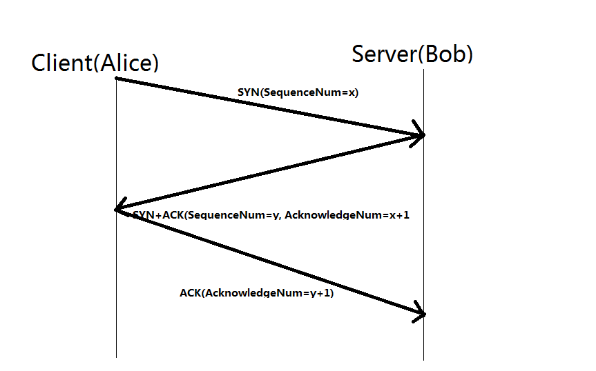
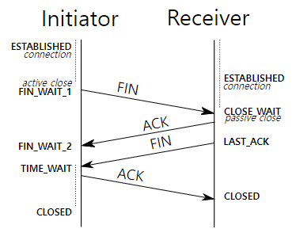
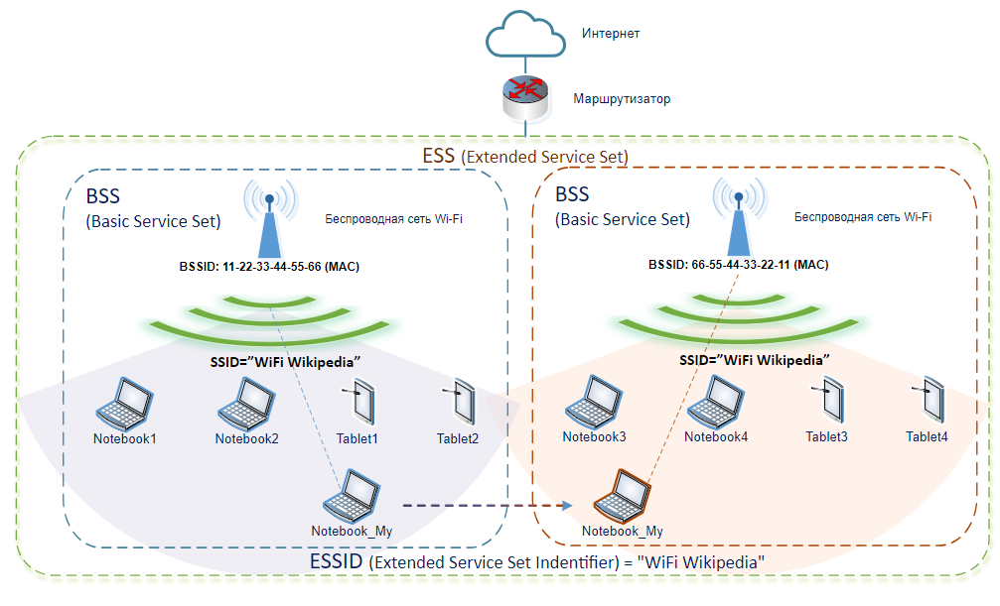
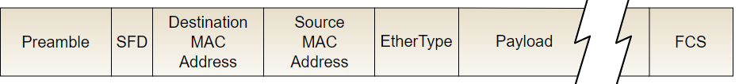

# 면접을 위한 CS 전공지식 노트
## Chapter 2: 네트워크
- 네트워크는 컴퓨터 등의 장치들이 통신 기술을 이용하여 구축하는 연결망을 지칭한다.
### Section 2.1: 네트워크의 기초
- 네트워크란 노드(Node)와 링크(Link)가 서로 연결되어 있거나 연결되어 있지 않는 집합체를 의미한다.
- 노드는 서버, 라우터, 스위치 등 네트워크 장치를 의미하고 링크는 유선 또는 무선을 의미한다.
#### 2.1.1 처리량과 지연 시간
- '좋은' 네트워크란 많은 처리량을 처리할 수 있으며 지연 시간이 짧고 장애 빈도가 적으며 좋은 보안을 갖춘 네트워크를 말한다.
- **처리량(Throughput)**
  - 링크를 통해 전달되는 단위 시간당 데이터양을 말한다.
  - 단위는 bps(bits per second)를 사용한다.
  - 처리량은 사용자들이 많이 접속할 때마다 커지는 트래픽, 네트워크 장치 간의 대역폭(주어진 시간 동안 네트워크 연결을 통해 흐를 수 있는 최대 비트 수), 네트워크 중간에 발생하는 에러, 장치의 하드웨어 스펙에 영향을 받는다.
- **지연 시간(Latency)**
  - 요청이 처리되는 시간을 말하며 어떤 메시지가 두 장치 사이를 왕복하는 데 걸린 시간을 말한다.
  - 지연 시간은 매체 타입(무선, 유선), 패킷 크기, 라우터의 패킷 처리 시간에 영향을 받는다.

#### 2.1.2 네트워크 토폴로지와 병목 현상

##### 네트워크 토폴로지(Network Topology)
-  노드와 링크가 어떻게 배치되어 있는지에 대한 방식이자 연결 형태를 의미한다.
- **트리 토폴로지(Tree Topology)**
  - 계층형 토폴로지라고 하며, 트리 형태로 배치한 네트워크 구성이다.
  - 노드의 추가, 삭제가 쉬우며 특정 노드에 트래픽이 집중될 때 하위 노드에 영향을 끼칠 수 있다.
- **버스 토폴로지(Bus Topology)**
  - 중앙 통신 회선 하나에 여러 개의 노드가 연결되어 공유하는 네트워크 구성이다.
  - 주로 근거리 통신망(LAN)에 사용한다.
  - 설치 비용이 적고 신뢰성이 우수하며 중앙 통신 회선에 노드를 추가하거나 삭제하기 쉽다.
  - 스푸핑(Spoofing)이 가능하다는 단점이 있다.
  - cf) 스푸핑 (Spoofing)
    - LAN상에서 송신부의 패킷을 송신과 관련 없는 다른 호스트에 가지 않도록 하는 스위칭 기능을 마비시키거나 속여서 특정 노드에 해당 패킷이 오도록 처리하는 것을 말한다.
- **스타 토폴로지(Star Topology)**
  - 중앙에 있는 노드에 모두 연결된 네트워크 구성을 말한다.
  - 노드를 추가하거나 에러를 탐지하기 쉽고 패킷의 충돌 발생 가능성이 적다.
  - 어떠한 노드에 장애가 발생해도 쉽게 에러를 발견할 수 있으며, 장애 노드가 중앙 노드가 아닐 경우 다른 노드에 영향을 끼치는 것이 적다.
  - 중앙 노드에 장애가 발생하면 전체 네트워크를 사용할 수 없고, 설치 비용이 고가이다.
- **링형 토폴로지(Ring Topology)**
  - 각각의 노드가 양 옆의 두 노드와 연결하여 전체적으로 고리처럼 하나의 연속된 길을 통해 통신을 하는 망 구성 방식이다.
  - 노드 수가 증가되어도 네트워크상의 손실이 거의 없고 충돌이 발생되는 가능성이 적으며 노드의 고장 발견을 쉽게 찾을 수 있다.
  - 네트워크 구성 변경이 어렵고 회선에 장애가 발생하면 전체 네트워크에 영향을 크게 끼친다.
- **메시 토폴로지(Mesh Topology)**
  - 망형 토폴로지라고도 하며 그물망처럼 연결되어 있는 구조이다.
  - 한 단말 장치에 장애가 발생해도 여러 개의 경로가 존재하므로 네트워크를 계속 사용할 수 있고 트래픽도 분산 처리가 가능하다.
  - 노드의 추가가 어렵고 구축 비용과 운용 비용이 고가이다.
##### 병목 현상(Bottleneck)
- 전체 시스템의 성능이나 용량이 하나의 구성 요소로 인해 제한을 받는 현상을 말한다.
- 서비스에서 이벤트를 열었을 때 트래픽이 많이 생기고 그 트래픽을 잘 관리하지 못하면 병목 현상이 생겨 사용자는 웹 사이트로 들어가지 못한다.
- 네트워크의 구조인 토폴로지는 병목 현상을 찾을 때 중요한 기준이 된다.
- e.g) 네트워크가 어떤 토폴로지를 갖는지, 어떤 경로로 이루어져 있는지를 알아야 병목 현상을 올바르게 해결할 수 있다.
  1. 병목 현상이 발생해서 대역폭을 크게 함으로써 지연 시간을 짧게 하려고 했지만 개선되지 않았다.
  2. 네트워크 토폴로지를 확인하고 게이트웨이로 이어지는 회선을 추가해서 병목 현상을 해결함
#### 2.1.3 네트워크 분류
- 네트워크는 규모를 기준으로, LAN, MAN, WAN으로 구분할 수 있다.
- **LAN(Local Area Network)**: 근거리 통신망을 의미하며, 같은 건물이나 캠퍼스 등의 좁은 공간에서 운영된다. 전송 속도가 빠르고 혼잡하지 않다.
- **MAN(Metropolitan Area Network)**: 대도시 지역 네트워크를 나타내며 도시 같은 넓은 지역에서 운영된다. 전송 속도는 평균이고 LAN보다는 더 많이 혼잡하다.
- **WAN(Wide Area Network)**: 광역 네트워크를 의미하며 국가 또는 대륙 같은 더 넓은 지역에서 운영된다. 전송 속도는 낮으며 MAN보다 더 혼잡하다.
#### 2.1.4 네트워크 성능 분석 명령어
- 네트워크 병목 현상의 주된 원인
  - 네트워크 대역폭
  - 네트워크 토폴로지
  - 서버 CPU 및 메모리 사용량
  - 비효율적인 네트워크 구성
- 여러 테스트롤 통해 네트워크로부터 발생한 문제가 맞는 지를 확실히 한 후에 네트워크 성능 분석을 해야한다.
- **Ping(Packet INternet Groper)**
  - 네트워크 상태를 확인하려는 대상 노드를 향해 일정 크기의 패킷을 전송한느 명령어이다.
  - 해당 노드의 패킷 수신 상태와 도달하기까지 시간 등을 알수 있으며 해당 노드까지의 연결 상태를 알 수 있다.
  - ICMP 프로토콜을 통해 동작하며, ICMP 프로토콜을 지원하지 않는 기기를 대상으로는 실행할 수 없거나 네트워크 정책상 ICMP나 traceroute를 차단하는 대상의 경우 ping 테스팅은 불가능하다.
- **netstat**
  - 접속되어 있는 서비스들의 네트워크 상태를 표시하는 데 사용된다.
  - 네트워크 접속, 라우팅 테이블,  네트워크 프로토콜 등 리스트를 보여준다.
  - 주로 서비스의 포트가 열려 있는지 확인할 때 사용한다.
- **nslookup**
  - DNS에 관련된 내용을 확인하기 위해 쓰는 명령어이다. 특정 도메인에 매핑된 IP를 확인하기 위해 사용한다.
- **tracert**
  - 윈도우에서는 tracert, 리눅스에서는 traceroute로 사용한다.
  - 목적지 노드까지 네트워크 경로를 확인할 때 사용하는 명령어이다.
  - 목적지 노드까지 구간들 중 어느 구간에서 응답 시간이 느려지는지 등을 확인할 수 있다.
#### 2.1.5 네트워크 프로토콜 표준화
- 네트워크 프로토콜: 다른 장치들끼리 데이터를 주고받기 위해 설정된 공통된 인터페이스를 말한다.
- 이러한 프로토콜은 IEEE 또는 IETF라는 표준화 단체가 이를 정한다.
- e.g.) IEEE802.3은 유선 LAN 프로토콜로, 유선으로 LAN을 구축할 때 쓰이는 프로토콜이다.
### Section 2.2: TCP/IP 4계층 모델
- 인터넷 프로토콜 스위트(Internet protocol suite)는 인터넷에서 컴퓨터들이 서로 정보를 주고받는 데 쓰이는 프로토콜의 집합이다. 주로 TCP/IP 4계층 모델이나 OSI 7계층 모델로 이를 설명한다.
- TCP/IP 4계층 모델은 네트워크에서 사용되는 통신 프로토콜의 집합으로 각 계층들은 프로토콜의 네트워킹 범위에 따라 네 개의 추상화 계층으로 구성된다.
#### 2.2.1 계층 구조
- TCP/IP 4계층

|계층|이름|예시|
|:----|:----|:----|
|4|애플리케이션 계층|FTP / HTTP / SSH / SMTP / DNS|
|3|전송 계층|TCP / UDP / QUIC|
|2|인터넷 계층|IP / ARP / ICMP|
|1|링크 계층|이더넷|

- OSI 7계층

|계층|이름|
|:----|:----|
|7|애플리케이션 계층|
|6|프레젠테이션 계층|
|5|세션 계층|
|4|전송 계층|
|3|네트워크 계층|
|2|데이터 링크 계층|
|1|물리 계층|

- 각 계층들은 특정 계층이 변경되었을 떄 다른 계층이 영향을 받지 않도록 설계되었다. 
##### 애플리케이션 계층(Application Layer)
  - FTP, HTTP, SSH, SMTP, DNS 등 응용 프로그램이 사용되는 프로토콜 계층이다.
  - 웹 서비스, 이메일 등 서비스를 실질적으로 사람들에게 제공하는 층이다.

##### 전송 계층(Transport Layer)
  - 송신자와 수신자를 연결하는 통신 서비스를 제공한다.
  - 연결 지향 데이터 스트림 지원, 신뢰성, 흐름 제어를 제공하고 애플리케이션 계층과 인터넷 계층 사이의 중계 역할을 한다.
  - e.g.) TCP, UDP
  - TCP(Transmission Control Protocol): 패킷 사이의 순서를 보장하고 연결지향 프로토콜을 사용해서 연결을 하여 신뢰성을 구축해서 수신 여부를 확인하며 가상회선 패킷 교환 방식을 사용한다.
  - UDP(User Datagram Protocol): 순서를 보장하지 않고 수신 여부를 확인하지 않으며 단순히 데이터만 주는 데이터그램 패킷 교환 방식을 사용한다.

###### 가상회선 패킷 교환 방식
- 각 패킷에는 가상회선 식별자가 포함되며 모든 패킷을 전송하면 가상회선이 해제되고 패킷들은 전송된 순서대로 도착하는 방식을 말한다.

###### 데이터그램 패킷 교환 방식
- 패킷이 독립적으로 최적의 경로를 선택하여 이동하며, 하나의 메시지에서 분할된 여러 패킷은 서로 다른 경로로 전송될 수 있으며 도착한 순서가 다를 수 있는 방식을 말한다.

###### TCP 연결 성립 과정: 3-Way Handshake

(출처: [위키피디아](https://en.wikipedia.org/wiki/Handshake_(computing)))

- TCP 통신을 위한 연결 시에 클라이언트와 서버는 다음과 같은 세 단계 과정을 거친다.

  1. SYN: 클라이언트가 서버에 자신의 ISN을 담아서 SYN 신호를 보낸다. ISN(Initial Sequence Numbers)은 새로운 TCP 연결의 첫 번째 패킷에 할당된 임의의 시퀀스 번호를 말한다.
  2. SYN + ACK: 서버는 클라이언트의 SYN를 수신하고 서버의 ISN을 보내며 승인번호로 클라이언트의 ISN에 1을 더한 값을 보낸다.
  3. ACK: 클라이언트는 서버의 ISN에 1을 더한 값을 ACK에 담아서 보낸다.

- 3-Way Handshake를 거친 후 신뢰성이 구축되며 데이터 전송을 시작한다. 이로 인해 TCP는 신뢰성이 있는 계층이라고 하며, 이 단계가 없는 UDP는 신뢰성이 없는 계층이라고 한다.

###### TCP 연결 해제 과정

(출처: [위키피디아](https://en.wikipedia.org/wiki/Transmission_Control_Protocol))

- TCP 통신의 연결 해제 시에는 다음과 같은 네 단계 과정을 거친다.

  1. 클라이언트가 연결을 닫으려고 할 때 FIN으로 설정된 세그먼트를 보낸다. 클라이언트는 FIN_WAIT_1 상태가 되어 서버의 응답을 기다린다.
  2. 서버는 클라이언트에 ACK라는 승인 세그먼트를 보낸다. 이후 CLOSE_WAIT 상태가 되며, 클라이언트는 ACK를 수신하고 FIN_WAIT_2 상태가 된다.
  3. 서버는 ACK를 보내고 일정 시간 이후에 FIN 세그먼트를 보낸다.
  4. 클라이언트는 FIN을 수신하고 TIME_WAIT 상태가 되어 서버로 다시 ACK를 보내서 서버는 CLOSE 상태가 된다. 이후 클라이언트는 ***일정 시간을 대기한 후*** 연결이 닫히고 둘 사이의 모든 자원 연결이 해제된다.

- TIME_WAIT에서 클라이언트가 바로 연결을 닫지 않고 대기하는 이유?
  1. 지연 패킷이 생길 경우를 대비하기 위해서. 패킷이 뒤늦게 도달하고 이를 처리하지 못한다면 데이터 무결성 문제가 발생한다.
  2. 두 장치가 연결이 닫혔는지 확인하기 위해서. 만약 LAST_ACK 상태에서 연결이 닫히면 다시 새로운 연결을 하려고 할 때 접속 오류가 생긴다.
##### 인터넷 계층(Internet Layer)
- 장치로부터 받은 네트워크 패킷을 IP 주소로 지정된 목적지로 전송하기 위해 사용되는 계층이다.
- e.g.) IP, ARP, ICMP 등
- 패킷을 수신해야 할 상대의 주소를 지정하여 데이터를 전달한다.
- 상대방이 제대로 받았는지에 대해 보장하지 않는 비연결형적인 특징이 있다.
##### 링크 계층(Link Layer)
- 전선, 광섬유, 무선 등으로 실질적으로 데이터를 전달하며 장치 간에 신호를 주고받는 규칙을 정하는 계층이다.
- '네트워크 접근 계층'이라고도 한다.
- '물리 계층'과 '데이터 링크' 계층으로 나누기도 한다.
  - 물리 계층: 무선 LAN과 유선 LAN을 통해 0과 1로 이루어진 데이터를 보내는 계층이다.
  - 데이터 링크 계층: 이더넷 프레임을 통해 에러 확인, 흐름 제어, 접근 제어를 담당하는 계층이다.
###### 유선 LAN(IEEE802.3)
- 유선 LAN을 이루는 인터넷은 IEEE802.3 프로토콜을 따르며 전이중화 통신을 사용한다.
- **전이중화 통신(Full duplex (communication) System)**
  - 양쪽 장치가 동시에 송수신할 수 있는 방식을 말한다.
  - 송신로와 수신로로 나눠서 데이터를 주고받으며 현대의 고속 이더넷은 이 방식을 기반으로 통신하고 있다.
- **CSMA/CD(Carrier Sense Multiple Access with Collision Detection)**
  - 이전에는 유선 LAN에 반이중화 통신 중 하나인 CSMA/CD를 많이 사용했다.
  - 데이터를 '보낸 이후' 충돌이 발생한다면 일정 시간 이후 재전송하는 방식을 말한다.
  - 하나의 경로를 기반으로 데이터를 보내기 때문에 데이터를 보낼 때 충돌을 대비하는 방법이다.
###### 유선 LAN을 이루는 케이블
- **트위스트 페어 케이블(TP Cable, Twisted Pair Cable)**
  - 여덟개의 구리선을 두 개씩 꼬아서 묶은 케이블을 말한다.
  - 각 구리선은 실드 처리하지 않고 이를 덮은 'UTP 케이블', 실드 처리하고 덮은 'STP 케이블'로 나눠진다.
  - UTP 케이블이 흔히 볼 수 있는 LAN 케이블이다.
  - cf) LAN 케이블을 꽂을 수 있는 커넥터를 RJ-45 커넥터라고 한다.
- 광섬유 케이블
  - 광섬유로 만든 케이블이며 레이저를 이용하여 통신하기 때문에 비교적 장거리 및 고속 통신이 가능하다. 보통 100Gbps의 전송 속도를 가진다.
  - 광섬유 내부와 외부를 다른 밀도를 가지는 유리나 플라스틱 섬유로 제작해서 한 번 들어간 빛이 내부에서 계속적으로 반사하며 전진하여 반대편 끝까지 가는 원리를 이용한다.
  - 내부의 빛의 굴절률이 높은 부분은 코어(Core)라고 하며 낮은 부분을 클래딩(Cladding)이라고 한다.
###### 무선 LAN(IEEE802.11)
- 무선 LAN 장치는 수신과 송신에 같은 채널을 사용하기 때문에 반이중화 통신을 사용한다.
- **반이중화 통신(Half duplex (communication) System)**
  - 양쪽 장치는 서로 통신할 수 있지만, 동시에는 통신할 수 없으며 한 번에 한 방향만 통신할 수 있는 방식을 말한다.
  - 일반적으로 장치가 신호를 수신하기 시작하면 응답하기 전에 전송이 완료될 때까지 기다려야 한다.
  - 둘 이상의 장치가 동시에 전송하면 충돌이 발생하여 메시지가 손실되거나 왜곡될 수 있기 때문에 충돌 방지 시스템이 필요하다.
- **CSMA/CA(Carrier Sense Multiple Access with Collision Avoidance)**
  - 반이중화 통신 중 하나로 장치에서 데이터를 보내기 전에 캐리어 감지 등으로 사전에 가능한 충돌을 방지하는 방식을 사용한다.
  - 동작 방식
    1. 데이터를 송신하기 전에 무선 매체를 살핀다.
    2. 캐리어 탐지(Carrier Sensing): 회선이 비어 있는지를 판단한다.
    3. IFS(Inter FrameSpace): 랜덤 값을 기반으로 정해진 시간만큼 기다리며, 만약 무선 매체가 사용 중이면 점차 그 간격을 늘려가며 기다린다.
    4. 이후에 데이터를 송신한다.
###### 무선 LAN을 이루는 주파수
- 무선 LAN(WLAN, Wireless Local Area Network)은 무선 신호 전달 방식을 이용하여 2대 이상의 장치를 연결하는 기술이다.
- 비유도 매체인 공기에 주파수를 쏘아 무선 통신망을 구축하며, 주파수 대역은 2.4GHz 또는 5GHz를 사용한다.
- 2.4GHz는 장애물에 강한 특성을 가지고 있지만, 전파 간섭이 일어나는 경우가 많고, 5GHz 대역은 사용할 수 있는 채널 수도 많고 동시에 사용할 수 있기 때문에 상대적으로 깨끗한 전파 환경을 구축할 수 있다.
- **와이파이(WiFi)**
  - 전자기기들이 무선 LAN 신호에 연결할 수 있게 하는 기술로, 사용하기 위해서는 무선 접속 장치 (AP, Access Point)가 있어야한다. 유선 LAN에 흐르는 신호를 무선 LAN 신호로 바꿔주어 신호가 닿는 범위 내에서 무선 인터넷을 사용할 수 있게 된다.
- **BSS(Basic Service Set)**
  - 기본 서비스 집합을 의미하며, 단순 공유기를 통해 네트워크에 접속하는 것이 아닌 동일 BSS 내에 있는 AP들과 장치들이 서로 통신이 가능한 구조를 말한다.
  - 근거리 무선 통신을 제공하고, 하나의 AP만을 기반으로 구축되어 있어 사용자가 한 곳에서 다른 곳으로 자유롭게 이동하며 네트워크에 접속하는 것이 불가능하다.
- **ESS(Extended Service Set)**
  - 하나 이상의 연결된 BSS 그룹이다.
  - 장거리 무선 통신을 제공하며 BSS보다 더 많은 가용성과 이동성을 지원한다.
  - 사용자는 한 장소에서 다른 장소로 이동하며 중단 없이 네트워크에 계속 연결할 수 있다.

(출처: [위키피디아](https://en.wikipedia.org/wiki/Service_set_(802.11_network)))

###### 이더넷 프레임
- 데이터 링크 계층은 이더넷 프레임을 통해 전달받은 데이터의 에러를 검출하고 캡슐한다.
- 이더넷 프레임 구조

(출처: [위키피디아](https://en.wikipedia.org/wiki/Ethernet_frame))

  - Preamble: 이더넷 프레임이 시작임을 알린다.
  - SFD(Start Frame Delimiter): 다음 바이트부터 MAC 주소 필드가 시작됨을 알린다.
  - DMAC, SMAC: 수신, 송신 MAC 주소를 말한다.
  - EtherType: 데이터 계층 위의 계층인 IP 프로토콜을 정의한다. e.g.) IPv4, IPv6 등
  - Payload: 전달받은 데이터
  - CRC(FCS): 에러 확인 비트

##### 계층 간 데이터 송수신 과정
- 송신: 애플리케이션 계층에서 링크 계층으로 요청 값들이 캡슐화 과정을 거쳐 전달된다.
- 수신: 링크 계층을 통해 수신한 데이터를 링크 계층에서 애플리케이션 계층까지 비캡슐화 과정을 거쳐 데이터가 전송된다.
###### 캡슐화 및 비캡슐화 과정

(출처: [위키피디아](https://en.wikipedia.org/wiki/Encapsulation_(networking)))

- 캡슐화: 상위 계층의 헤더와 데이터를 하위 계층의 데이터 부분에 포함쉬키고 해당 계층의 헤더를 삽입하는 과정을 말한다.
- 비캡슐화: 하위 계층에서 상위 계층으로 가며 각 계층의 헤더 부분을 제거하는 과정을 말한다.

#### 2.2.2 PDU
- 네트워크의 한 계층에서 다른 계층으로 데이터가 전달될 때 한 덩어리의 단위를 PDU(Protocol Data Unit)이라고 한다.
- PDU는 제어 관련 정보들이 포함된 '헤더', 데이터를 의미하는 '페이로드'로 구성되어 있으며 계층마다 부르는 명칭이 다르다.

|계층|PDU 명칭|
|:----|:----|
|애플리케이션 계층|메시지|
|전송 계층|세그먼트(TCP), 데이터그램(UDP)|
|인터넷 계층|패킷|
|링크 계층|프레임(데이터 링크 계층), 비트(물리 계층)|

### Section 2.3: 네트워크 기기
#### 2.3.1 네트워크 기기의 처리 범위
- 네트워크 기기는 계층별로 처리 범위를 나눌 수 있다.
- 상위 계층을 처리하는 기기는 하위 계층을 처리할 수 있지만 그 반대는 불가능하다.

|계층|네트워크 기기|
|:----|:----|
|애플리케이션 계층|L7 스위치|
|전송 계층|라우터, L3 스위치|
|인터넷 계층|브리지, L2 스위치|
|링크 계층|NIC, 리피터, AP|

#### 2.3.2 애플리케이션 계층을 처리하는 기기
##### L7 스위치
- 스위치(Switch): 여러 장비를 연결하고 데이터 통신ㅇ르 중재하며 목적지가 연결된 포트로만 전기 신호를 보내 데이터를 전송하는 통신 네트워크 장비이다.
- L7 스위치는 '로드밸런서'라고도 하며 서버의 부하를 분산하는 기기이다. 클라이언트로부터 오는 요청들을 뒤쪽의 여러 서버로 나누는 역할을 하며 시스템이 처리할 수 있는 트래픽 증가를 목표로 한다.
- URL, 서버, 캐시, 쿠키들을 기반으로 **트래픽을 분산**하고 바이러스 및 불필요한 외부 데이터 등을 걸러내는 **필터링 기능** 또한 가지고 있으며, 응용 프로그램 수준의 **트래픽 모니터링**도 가능하다.
- e.g.) 장애가 발생한 서버가 있으면 이를 트래픽 분산 대상에서 제외해야 한다. 이는 정기적으로 헬스 체크(health check)를 이용하여 감시하면서 이루어진다.

##### L4, L7 스위치 차이
- L4 스위치도 로드밸런서의 역할을 수행하지만 L4 스위치는 인터넷 계층을 처리하는 기기로 스트리밍 관련 서비스에서는 사용할 수 없으며 메시지를 기반으로 인식하지 못하고 IP와 포트를 기반으로(특히 포트 기반) 트래픽을 분산한다. L7 로드밸런서는 IP, 포트, URL, HTTP 헤더, 쿠키 등을 기반으로 트래픽을 분산한다.
- cf) 클라우드 서비스(e.g.) AWS)에서 L7 스위치를 이용한 로드밸런싱은 ALB(Application Load Balancer) 컴포넌트로 하며, L4 스위치를 이용한 로드밸런싱은 NLB(Network Load Balancer) 컴포넌트로 한다.

##### 헬스 체크
- L4, L7 스위치 모두 헬스 체크를 통해 정상적인 서버 또는 비정상적인 서버를 판별한다.
- 헬스 체크는 전송 주기와 재전송 횟수 등을 설정한 이후 반복적으로 서버에 요청을 보내는 것을 말한다.
- 서버에 부하가 되지 않을 정도로 TCP, HTTP 등 다양한 방법으로 요청을 보내며 이 요청이 정상적으로 이루어졌다면 정상적인 서버로 판별한다.

##### 로드밸런서를 이용한 서버 이중화
- 서버 이중화는 로드밸런서의 대표적인 기능이다.
- 서비스를 안정적으로 운용하기 위해서는 2대 이상의 서버는 필수적이다. 로드 밸런서는 이 서버들에 가상 IP를 제공하고  이를 기반으로 안정적인 서비스를 제공한다.

#### 2.3.3. 인터넷 계층을 처리하는 기기
##### 라우터(Router)
- 여러 개의 네트워크를 연결, 분할, 구분시키주는 역할을 하며 "다른 네트워크에 존재하는 장치끼리 서로 데이터를 주고받을 때 패킷 소모를 최소화하고 경로를 최적화하여 최소 경로로 패킷을 포워딩"하는 라우팅을 수행하는 장비이다.
##### L3 스위치
- L3 스위치는 L2 스위치의 기능에 라우팅 기능을 갖춘 장비를 말한다. 라우터는 소프트웨어 기반의 라우팅과 하드웨어 기반의 라우팅을 하는 것으로 나눠지고 하드웨어 기반의 라우팅을 담당하는 장치가 L3 스위치이다.

|구분|L2 스위치|L3 스위치|
|:---|:------:|:--------:|
|참조 테이블|MAC 주소 테이블|라우팅 테이블|
|참조 PDU|이더넷 프레임|IP 패킷|
|참조 주소|MAC 주소|IP 주소|

#### 2.3.4. 데이터 링크 계층을 처리하는 기기
##### L2 스위치
- 장치들의 MAC 주소를 MAC 주소 테이블을 통해 관리하며, 연결된 장치로부터 패킷이 왔을 때 패킷 전송을 담당한다.
- IP 주소를 이해하지 못해 IP 주소를 기반으로 라우팅은 불가능하며 단순히 패킷의 MAC 주소를 읽어 스위칭하는 역할을 한다.
- 목적지가 MAC 주소 테이블에 없다면 전체 포트에 전달하고 MAC 주소 테이블의 주소는 일정 시간 이후 삭제하는 기능도 있다.
##### 브리지(Bridge)
- 두 개의 근거리 통신망(LAN)을 상호 접속할 수 있도록 하는 통신망 연결 장치이다.
- 포트와 포트 사이의 다리 역할을 하며 장치에서 받아온 MAC 주소를 MAC 주소 테이블로 관리한다.
- 통신망 범위를 확장하고 서로 다른 LAN 등으로 이루어진 '하나의' 통신망을 구축할 때 쓰인다.

#### 2.3.5 물리 계층을 처리하는 기기
##### NIC(Network Interface car, 네트워크 인터페이스 카드)
- 2대 이상의 컴퓨터 네트워크를 구성하는 데 사용하며, 네트워크와 빠른 속도로 데이터를 송수신할 수 있도록 컴퓨터 내에 설치하는 확장 카드이다.
- 각각의 LAN 카드에는 고유 식별번호인 MAC 주소가 있다.
##### 리피터(Repeater)
- 들어오는 약해진 신호 정도를 증폭하여 다른 쪽으로 전달하는 장치를 말한다.
- 리피터를 통해 패킷을 더 멀리 보낼 수 있지만 광케이블 보급으로 잘 쓰이지 않는다.
##### AP (Access Point)
- 패킷을 복사하는 기기이며, AP에 유선 LAN을 연결한 후 다른 장치에서 무선 LAN 기술을 사용하여 무선 네트워크 연결을 할 수 있다.