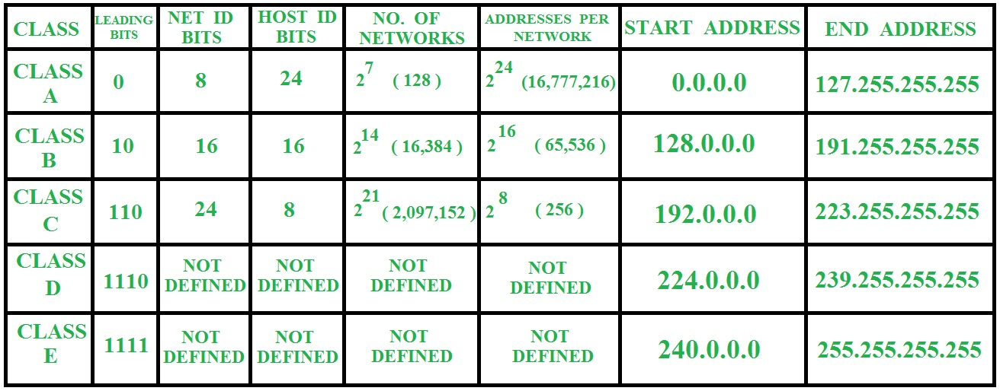
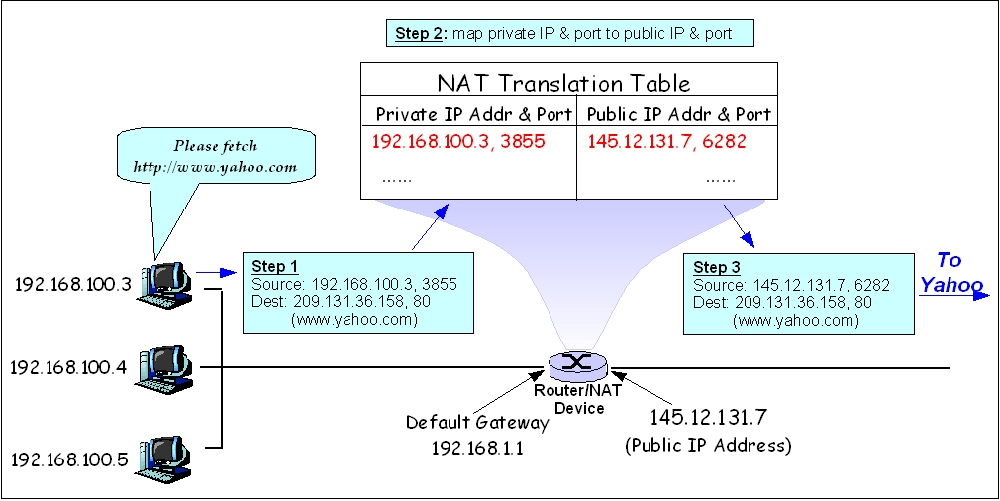

## Chapter 2: 네트워크

### Section 2.4: IP 주소

#### 2.4.1 ARP

- 컴퓨터 통신은 IP주소에서 ARP를 통해 MAC 주소를 찾아서 MAC 주소를 기반으로 통신한다.
- **ARP (Address Resolution Protocol)**: IP주소로부터 MAC 주소를 구하는 IP와 MAC 주소의 다리 역할을 하는 프로토콜이다.
- ARP를 통해 자상 주소인 IP 주소를 실제 주소인 MAC 주소로 변환하며, RARP를 통행 실제 주소인 MAC 주소를 가장 주소인 IP 주소로 변환하기도 한다.
- 송신자가 ARP 브로드캐스트로 IP를 담아서 상대의 MAC 주소를 전체에 질의하면, 수신자는 자신의 MAC 주소를 담아서 송신자에게 유니캐스트로 보낸다.

#### 2.4.2 홉바이홉 통신

- IP 주소를 통해 통신하는 과정을 (Hop By Hop) 통신이라고 하며, 각 네트워크의 각 패킷이 여러 개의 라우터를 건너가는 모습을 비유적으로 표현한 것이다.
- 각각의 라우터에 있는 라우팅 테이블의 IP를 기반으로 패킷을 전달한다. 즉, 통신 장치에 있는 라우팅 테이블의 IP를 통해 시작 주소부터 시작해서 다음 IP로 계속해서 이동하는 라우팅을 통해 패킷이 최종 목적지로 도달한다.

##### 라우팅 테이블

- **라우팅 테이블(Routing table)**: 라우터에 들어가 있는 목적지 정보들과 그 목적지로 가기 위한 방법이 들어 있는 리스트를 말한다.
- 라우팅 테이블에는 게이트웨이와 모든 목적지에 대해 해당 목적지에 도달하기 위해 거쳐야 할 다음 라우터의 정보를 가지고 있다.

##### 게이트웨이

- **게이트 웨이(Gateway)**: 서로 다른 통신망, 프로토콜을 사용하는 네트워크 간의 통신을 가능하게 하는 관문 역할을 하는 컴퓨터나 소프트웨어를 말한다.
- 서로 다른 네트워크상의 통신 프로토콜을 변환해주는 역할을 하기도 한다.
- 게이트웨이는 라우팅 테이블을 통해 확인 할 수 있으며, 윈도우 기준으로 netstate -r 명령어를 사용하면 된다.

#### 2.4.3 IP 주소 체계

- IPv4는 32비트를 8비트 단위로 점을 찍어 표기하고 (e.g.) 123.45.67.89), IPv6는 64비트를 16비트 단위로 점을 찍어 표기한다(e.g.) 2001:db8:ff00:42:8329).

##### 클래스 기반 할당 방식

(출처: [geeksforgeeks](https://www.geeksforgeeks.org/introduction-of-classful-ip-addressing/))

- 초기에는 IP 주소를 5개의 클래스로 구분하는 클래스 기반 할방 방식(Classful Addressing)을 사용했으며, 점차 IP주소가 부족해지면서 클래스 없는 도메인 간 라우팅 기법(CIDR, Classless Inter-Domain Routing) 등을 사용하기 시작했다.
- 클래스 기반 할방 방식에서는 주소의 앞 부분을 네트워크 주소, 뒷 부분을 호스트 주소로 나누어 사용한다.
- A,B,C를 일대일 통신에 사용하고, D를 멀티캐스트용, E를 앞으로 사용할 예비용으로 가지고 있도록 한다.

(출처: [geeksforgeeks](https://www.geeksforgeeks.org/introduction-of-classful-ip-addressing/))

- 맨 앞에 있는 1~4자리 비트를 구분 비트, 또는 리딩 비트라고 하며, 해당 주소의 클래스를 나타낸다.
- 각 클래스의 첫번째 주소는 네트워크 구별 주소, 가장 마지막 주소는 브로드캐스트용으로 사용하기 때문에 다른 할당을 해서는 안된다.
  - e.g.) 클래스 A로 12.0.0.0의 네트워크를 부여받았을 때, 12.0.0.0은 네트워크 구별 주소, 12.255.255.255는 브로드캐스트용으로 사용되며, 사이의 주소인 12.0.0.1~12.255.255.254를 할당에 사용할 수 있다.

##### CIDR

- **클래스 없는 도메인 간 라우팅 기법(CIDR, Classless Inter-Domain Routing)**: 네트워크 정보를 여러개로 나누어진 서브 네트워크들을 모두 나타낼 수 있는 하나의 네트워크로 통합해서 보여주는 방법이다.
- IP주소를 쪼개서 사용하는 서브네팅과 서브넷을 합치는 슈퍼네팅은 CIDR의 일환이다.
- e.g.) 192.168.10.70/26
- 서브넷 마스크의 길이를 가변으로 해서 아이피 뒤에 해당 갯수를 붙여서 표현한다. 위의 예제의 서브넷 마스크의 길이는 26이다.
  - 마지막 바이트에서 위의 (26 - 24) 2개이므로 2개는 1, 나머지는 0으로 채움으로써 서브넷 마스크는 255.255.255.192가 된다.
- 서브넷 마스크를 호스트ID 방향으로 움직이면(값 증가) 서브네팅, 네트워크 ID 방향으로 움직이면 슈퍼네팅이다.
- cf)
  - CIDR 블록: AWS에서 사용하는 서브넷을 가리키는 용어
  - AWS에서는 자체 클라우드에서 설정해 사용하고 있는 IP 때문에 호스트 계산 시에 2개의 IP가 아닌 5개의 IP를 제외해야 한다.

##### DHCP
- **DHCP(Dynamic Host Configuration Protocal)**: IP 주소 및 기타 통신 매개변수를 자동으로 할당하기 위한 네트워크 관리 프로토콜이다.
- 네트워크 장치의 IP 주소를 수동으로 설정할 필요 없이 인터넷에 접속할 때마다 자동으로 IP 주소를 할당할 수 있다.
##### NAT
- **NAT(Network Address Translation)**: 패킷이 라우팅 장치를 통해 전송되는 동안 패킷의 IP 주소 정보를 수정하여 IP 주소를 다른 주소로 매핑하는 방법이다.
- IPv4 주소 체계만으로는 절대적인 주소량이 부족하게 되었고, 이를 해결하기 위해 NAT로 공인 IP와 사설 IP로 나눠서 많은 주소를 처리하게 되었다.
- NAT를 가능하게 하는 SW는 ICS, RRAS Netfilter 등이 있다.
- NAT 장치를 통해 사설 IP와 공인 IP 간의 변환을 수행한다.

(출처: [위키피디아](https://en.wikipedia.org/wiki/Network_address_translation))

###### 공유기와 NAT
- 여러 대의 호스트가 하나의 공인 IP 주소로 인터넷에 접속하기 위해 NAT를 사용한다.
- 인터넷 회선 하나에 하나의 공유기로 여러 PC를 사용할 수 있는데, 이는 보통 공유기에 NAT 기능이 있기 때문이다.

###### NAT를 통한 보안
- NAT로 내부 IP와 외부 IP를 다르게 유지할 수 있기 때문에 내부 네트워크에 대한 어느 정도의 보안이 가능하다.

###### NAT의 단점
- NAT는 여러 명이 동시에 인터넷을 접속하게 되기 때문에 접속 호스트수에 따라 접속 속도가 느려질 수 있다.

#### 2.4.4 IP 주소를 이용한 위치 정보
- IP 주소는 인터넷에서 사용하는 네트워크 주소이기 떄문에 이를 통해 동 또는 구까지 위치 추적이 가능하다.