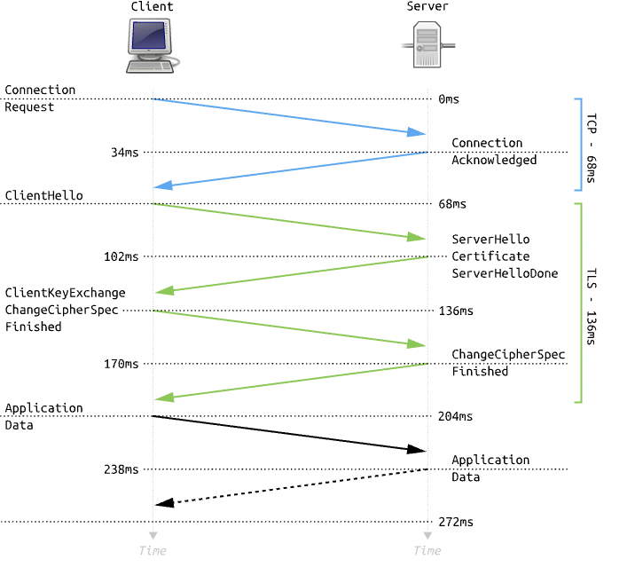
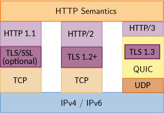

## Chapter 2: 네트워크
### Section 2.5: HTTP
#### 2.5.1 HTTP/1.0
- HTTP/1.0은 기본적으로 한 연결당 하나의 요청을 처리하도록 설계되었다. 때문에 RTT(패킷 왕복 시간)이 증가하는 결과가 생겼다.
##### RRT 증가를 해결하기 위한 방법
###### 이미지 스플리팅
- 많은 이미지를 받게 되면 과부하가 걸리기 때문에 여러 이미지가 합쳐저 있는 하나의 이미지를 다운받고, 이를 기반으로 background-image의 position을 이용하여 이미지를 표기하는 방법이다.
###### 코드 압축
- 코드를 압축해서 개행 문자, 빈칸을 없애서 코드의 크기를 최소화하는 방법이다.
###### 이미지 Base64 인코딩
- 이미지 파일을 Base64 문자열로 인코딩하는 방법이다. 서버와의 연결을 열고 이미지에 대한 HTTP 요청을 할 필요가 없다는 장점이 있지만, 문자열 변환으로 크기가 37% 정도 커진다는 단점이 있다.

#### 2.5.2 HTTP/1.1
- HTTP/1.0과 달리 매번 TCP를 연결하는 것이 아니라, 한 번 TCP 초기화를 한 이후에 keep-alive 옵션으로 여러 개의 파일을 송수신할 수 있게 되었다. HTTP/1.0에도 keep-alive 옵션이 있었지만 HTTP/1.1에서 표준화가 되었다.
- 한 번 연결을 하면 여러 파일을 송신하는 동안 연결을 다시 수행하지 않는다. 하지만 문서 내의 여러 리소스를 처리하려면 요청할 리소스 개수에 비례해서 대기 시간이 길어진다.

##### HOL Blocking
- **HOL Blocking(Head Of Line Blocking)**: 네트워크에서 같은 큐에 있는 패킷이 첫 번째 패킷에 의해 지연될 때 발생하는 성능 저하 현상을 말한다.

##### 무거운 헤더 구조
- HTTP/1.1의 헤더는 쿠키 등의 많은 메타데이터가 압축되지 않는 상태로 존재하기 때문에 상대적으로 무겁다.

#### 2.5.3 HTTP/2
- SPDY 프로토콜에서 파생된 HTTP/1.x보다 지연 시간을 줄이고 응답 시간을 빠르게 할 수 있으며, 멀티 플렉싱, 헤더 압축, 서버 푸시, 요청의 우선 순위 처리등을 지원한다.
##### 멀티플렉싱
- 멀티플렉싱(Multiplexing): 여러 개의 스트림을 사용하여 송수신을 하는 것을 말한다. 특정 스트림의 패킷이 손실되었다고 하더라도 나머지 스트림은 영향없이 동작한다.
- 애플리케이션에서 받아온 메시지를 독립된 프레임으로 조각내어 서로 송수신하고, 다시 조립하면서 데이터를 주고 받는다.
- 단일 연결을 사용해서 병렬로 여러 요청을 받을 수 있으며, 이를 통해 HOL Blocking 현상을 해결할 수 있다.
##### 헤더 압축
- HTTP/2에서는 허프만 코딩 압축 알고리즘을 사용하는 HPACK 압축 형식을 가지므로써 HTTP/1.x의 큰 헤더 문제를 해결하였다.
- **허프만 코딩(Huffman coding)**: 문자열을 문자 단위로 쪼개 빈도수를 세어 빈도가 높은 정보는 적은 비트 수를 사용하여 표현하고, 빈도가 낮은 정보는 비트 수를 많이 사용하여 표현해서 전체 데이터의 표현에 필요한 비트양을 줄이는 원리이다.
##### 서버 푸시
- HTTP/1.1에서는 클라이언트가 서버에 요청을 해야 파일을 다운받을 수 있었지만, HTTP/2는 클라이언트 요청 없이 서버가 바로 리소스를 푸시할 수 있다.
- e.g.) html에는 css나 js 파일이 포함되기 마련이고, html를 읽으면서 포함된 css나 js를 서버에서 푸시하여 클라이언트에 먼저 줄 수 있다.

#### 2.5.4 HTTPS

- HTTP/2는 HTTPS 위에서 동작한다.
- HTTPS는 애플리케이션 계층과 전송 계층 사이에 신뢰 계층인 SSL/TLS 계층을 넣은 신뢰할 수 있는 암호화된 통신을 하는 HTTP 요청을 말한다.

##### SSL/TLS 

- **SSL(Secure Socket Layer)**: 전송 계층에서 보안을 제공하는 프로토콜이다. 클라이언트와 서버가 통신할 때 SSL/TLS을 통해 제3자가 메시지를 도청하거나 변조하지 못하도록 한다.
- cf) SSL 1.0, 2.0, 3.0 및 TLS(Transport Layer Security Protocol) 1.0, 1.3으로 버전업 되면서 명칭이 TLS으로 바뀌었으나, 보통 합쳐서 SSL/TLS로 부른다.
- SSL/TLS를 통해 서버인 척 접근하여 정보를 중간에서 가로채는 인터셉트를 방지할 수 이싿.
- SSL/TLS은 보안 세션을 기반으로 데이터를 암호화하며 보안 세션이 만들어질 때 인증 메커니즘, 키 교환 암호화 알고리즘, 해싱 알고리즘이 사용된다.

###### 보안 세션

- 보안 세션: 보안이 시작되고 끝나는 동안 유지 세션을 말한다.
- SSL/TLS는 핸드세이크를 통해 보안 세션을 생성하고 이를 기반으로 상태 정보 등을 공유한다.
- cf) Session: 운영체제가 어떠한 사용자로부터 자신의 자산 이용을 허락하는 일정한 기간을 말한다.

- TLS 핸드쉐이크

(출처: [위키피디아](https://en.wikipedia.org/wiki/Transport_Layer_Security))

  - 클라이언트와 서버가 키를 공유하고 이를 기반으로 인증 및 인증 확인 과정이 일어나는 단 한번의 1-RTT 이후에 데이터를 송수신한다.
  - 클라이언트에서 사이퍼 스위트(Cypher suite)를 서버에 전달하면 서버는 해당 사이퍼 슈트의 암호화 알고리즘 리스트를 제공할 수 있는지를 확인하고 서버에서 클라이언트로 인증서를 보내는 인증 메커리즘을 시작한다. 이후 해싱 알고리즘 등으로 암호화된 데이터의 송수신이 시작된다.

- *사이퍼 스위트(Cypher suite)*
  - 프로토콜, AEAD 사이퍼 모드, 해싱 알고리즘이 나열된 규약을 말한다.
  - e.g.) TLS_AES_128_GCM_SHA256
    - TLS, AES_128_GCM (AES 사이퍼 모드), SHA256 (해싱 알고리즘)

- *AEAD 사이퍼 모드*
  - AEAD(Authenticated Encryption with Associated Data)는 데이터 암호화 알고리즘의 한 종류이다.
  - e.g) AES_128_GCM: 128비트의 키를 사용하는 표준 블록 암호화 기술과 병렬 계산에 용이한 암호화 알고리즘 GCM이 결합된 알고리즘이다.

###### 인증 매커니즘
- CA(Certificate Authorities)에서 발급한 인증서를 기반으로 이루어지며, 해당 인증서는 안전한 연결을 시작하는 데 있어 필요한 공개키를 클라이언트에 제공하고 사용자가 접속한 서버가 '신뢰할 수 있음'을 보장한다.
- 인증서는 서비스 정보, 공개키, 지문, 디지털 서명 등으로 이루어져 있다.
- *CA 발급 과정*
  - 자신의 사이트 정보와 공개키를 CA에 제출해야한다.
  - CA는 공개키를 해시한 값인 finger print를 사용하는 CA의 비밀키 등을 기반으로 CA 인증서를 발급한다.

###### 암호화 알고리즘
- 키 교환 암호화 알고리즘으로는 대수곡선 기반의 ECDHE(Elliptic Curve Diffie-Hellman Ephermeral) 또는 모듈식 기반의 DHE(Diffie-Hellman Ephermeral)를 사용한다. 두 방식 모두 디피-헬만 방식을 근간으로 만들어졌다.
- *디피-헬만 키 교환 암호화(Diffie-Hellman key exchange) 알고리즘*
  > y = g^x mod p
    - g, x, p 값을 안다면 y는 구하기 쉽지만 y, g, p만 안다면 x는 구하기 어렵다는 원리에 기반한 알고리즘이다.
    - 상세 방법 참고: [위키피디아](https://en.wikipedia.org/wiki/Diffie%E2%80%93Hellman_key_exchange)

###### 해싱 알고리즘
- 데이터를 추정하기 힘들도록 더 작고 섞여 있는 조각으로 만드는 알고리즘이다.
- SSL/TLS는 보통 SHA-256과 SHA-384를 사용한다.
- *SHA-256*
  - 해시 값이 256비트인 알고리즘이다.
  - 해싱을 해야하는 메시지에 1를 추가하는 등 전처리를 하고 전처리된 메시지를 기반으로 해시를 반환한다.

cf) TLS 1.3은 사용자가 이전에 방문한 사이트로 방문할 경우 보안 세션을 다시 만들지 않아도 되며, 이를 0-RTT라고 한다.

##### SEO에도 도움이 되는 HTTPS
- 구글은 사이트 내 모든 요소가 동일하다면 HTTPS 서비스를 하는 사이트가 그렇지 않은 사이트보다 SEO 순위가 높을 것이라고 하였다.
- SEO(Search Engine Optimization)는 웹 사이트를 검색했을 때 그 결과를 페이지 상단에 노출시켜 많은 사람이 볼 수 있도록 최적화하는 방법을 의미한다.
- 이를 위한 방법으로 캐노니컬 설정, 메타 설정, 페이지 속도 개선, 사이트맵 관리 등이 있다.

##### HTTPS 구축 방법
1. 직접 CA에서 구매한 인증키를 기반으로 HTTPS 서비스 구축하기
2. 서버 앞단의 HTTPS를 제공하는 로드밸런서를 두기
3. 서버 앞단에 HTTPS를 제공하는 CDN을 두기

#### 2.5.5 HTTP/3
- HTTP/2가 TCP 위에서 동작하는 것과 달리 HTTP/3는 QUIC이라는 계층위에서 돌면서 UDP 기반으로 동작한다.
- HTTP/2와 마찬가지로 멀티플랙싱 기능을 제공하며 초기 연결 설정 시 지연 시간이 감소하였다.

(출처: [위키피디아](https://en.wikipedia.org/wiki/HTTP/3))

##### 초기 연결 설정 시 지연 시간 감소
- QUIC은 TCP를 사용하지 않기 때문에 통신을 시작할 때 번거로운 3-way handshake를 수행하지 않는다. 
- QUIC은 클라이언트가 서버에 신호를 한 번 보내고 이에 응답하기만 하면 바로 데이터 통신을 할 수 있어서 첫 연결 설정에 1-RTT만 소요된다.
- QUIC은 순방향 오류 수정(FEC, Forword Error Correction)이 사용되기 때문에 패킷 손실률이 낮다.