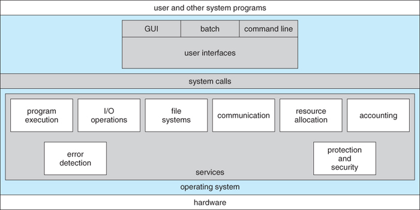

# Chapter 3: 운영체제
- **운영체제(OS, Operating System)**: 사용자가 컴퓨터를 쉽게 다루게 해주는 인터페이스이다. 한정된 메모리와 같은 시스템 자원을 효율적으로 분배하는 등의 일을 수행한다.
- 운영체제와 유사하지만 소프트웨어를 추가로 설치할 수 없는 것을 펌웨어(Firmware)라고 한다.
## Section 3.1: 운영체제와 컴퓨터
### 3.1.1 운영체제의 역할과 구조
#### 운영체제의 역할
1. CPU 스케줄링과 프로세스 관리
   - CPU의 소유권을 프로세스에 할당, 프로세스의 생성 및 삭제, 자원 할당 및 반환을 관리한다.
2. 메모리 관리
   - 한정된 메모리를 프로세스에 할당할 양을 관리한다.
3. 디스크 파일 관리
   - 디스크 파일을 어떤식으로 보관할 지를 관리한다.
4. I/O 디바이스 관리
   - I/O 디바이스와 컴퓨터 간에 데이터를 주고받는 것을 관리한다.

#### 운영체제의 구조

(출처: Abraham Silberschatz, Greg Gagne, and Peter Baer Galvin, "Operating System Concepts, Ninth Edition ", Chapter 2)

- 유저 프로그램과 하드웨어 사이에서 동작하며, 위에서부터 UI, 시스템콜, 커널과 드라이버를 포함한 서비스들의 순서대로 위치한다.

##### 시스템콜
- **시스템콜(System Call)**: 운영체제가 커널에 접근하기 위한 인터페이스이며, 유저 프로그램이 운영체제의 서비스를 받기 위해 커널 함수를 호출할 때 쓴다.
- e.g.) I/O 요청을 위해 유저 프로그램이 트랩(Trap)을 발동하면 올바른 I/O 요청인지 확인한 후 유저 모드가 시스템콜을 통해 커널 모드로 변환되고 I/O가 실행된다. I/O가 완료되면 다시 유저 모드로 전환된다.
- 프로세스나 스레드에서 OS에 요청을 할 때는 '시스템콜'이라는 인터페이스와 커널을 통해 OS로 전달된다.
- 시스템콜은 하나의 추상화 계층이며, 이 때문에 유저 프로그램에서는 하위 레벨의 동작을 크게 신경쓰지 않아도된다.

###### modebit
- 1 또는 0의 값을 가지는 플래그 변수 이며, 유저 모드와 커널 모드를 구분하기 위해 사용된다.
- 1은 유저모드, 0은 커널 모드를 의미하며 유저 모드에서는 시스템콜의 동작을 수행하지 못하게 함으로써 자원 접근에 제한을 둔다.

### 3.1.2 컴퓨터의 요소
- 컴퓨터는 CPU, DMA 컨트롤러, 메모리, 타이머, 디바이스 컨트롤러 등으로 이루어져있다.
#### CPU
- **CPU(Central Processing Unit)**: 메모리에 존재하는 명령어를 해석해서 수행하는 장치를 말하며, 산술논리연산장치, 제어장치, 레지스터로 구성되어 있다.
##### 제어장치
- **제어장치(CU: Control Unit)**: CPU내에서 프로세스 조작을 지시하는 역할을 한다.
- 입출력장치 간의 통신을 제어하고 명령어들을 읽고 해석하며 데이터 처리를 위한 순서를 결정한다.
##### 레지스터
- **레지스터(Register)**: CPU내의 매우 빠른 임시기억장치이다.
- CPU와 직접 연결되어 있으므로 속도가 타 메모리와 비교하여 매우 빠르다.
- CPU는 자체적으로 데이터를 저장할 수 없기 때문에 레지스터를 거쳐서 데이터를 전달한다.
##### 산술논리연산장치
- **산술논리연산장치(ALU: Arithmetic Logic Unit)**: 산술 연산과 논리 연산을 수행한다.
###### CPU의 연산처리의 예시
1. CU가 메모리에 계산할 값을 로드힌다. 해당 값을 레지스터에도 로드한다.
2. CU에 명령에 따라 ALU는 연산을 수행한다.
3. CU가 레지스터에 있는 계산된 값을 메모리에 저장한다.

##### 인터럽트
- **인터럽트(Interupt)**: 예기치 않은 상황 등의 모종의 이유로 발생된 신호를 확인하고 CPU를 잠시 정지하는 것을 말한다.
- 인터럽트 간에는 우선순위가 존재하며, 이에 따라 실행된다.
- 하드웨어 인터럽트, 소프트웨어 인터럽트로 나누어진다.
- cf) 인터럽트 핸들러(Interupt Handling) 함수: 인터럽트가 발생했을 때 이를 핸들링하기 위한 함수이다. 커널 내부의 IRQ를 통해 호출되며 requet_irq()를 통해 등록할 수 있다.
###### 외부(하드웨어) 인터럽트
- 전원(파워) 이상, CPU 기능 문제, IO 장치 문제 등으로 발생하는 인터럽트이다.
- IO 인터럽트의 경우, 만들어진 인터럽트 라인을 따라 순차적으로 인터럽트 실행을 중지하고 운영체제에 시스템콜을 요청해서 원하는 디바이스로 향해 디바이스에 있는 작은 로컬 버퍼에 접근하여 일을 수행한다.
###### 내부 인터럽트
- 소프트웨어 인터럽트의 일종이며, 잘못된 명령이나 잘못된 데이터를 사용했을 때 발생한다.
- Divion by zero, Overflow & Underflow 등이 있다.
###### 소프트웨어 인터럽트
- 프로그램 처리 중에 명령의 요청에 의해서 발생한다.
- 소프트웨어 실행 중에 다른 프로세스를 실행시키면 시분할 처리를 위해 저원 할당 등의 동작을 수행한다.
- 대표적인 형태는 프로그램에서의 감시 프로그램(SVC) 호출이 있다.

(참고: [인터럽트(interrupt), 예외(exception), 트랩(trap)의 비교](https://melonicedlatte.com/computerarchitecture/2019/02/12/213856.html))

#### DMA 컨트롤러
- IO 장치가 메모리에 직접 접근할 수 있도록 하는 하드웨어 장치이다.
- CPU에 많은 인터럽트 요청이 들어오기 때문에 이를 분담하여 CPU 부하를 막아주는 역할을 한다.

#### 메모리(Memory)
- 회로에 데이터나 상태, 명령어 등을 기록하는 장치를 말한다.

#### 타이머(Timer)
- 프로세스의 작업이 끝나야 하는 시간을 정하고 시간 제한을 걸어주는 장치이다.

#### 디바이스 컨트롤러
- 컴퓨터와 연결되는 IO 장치들의 작은 CPU이다.