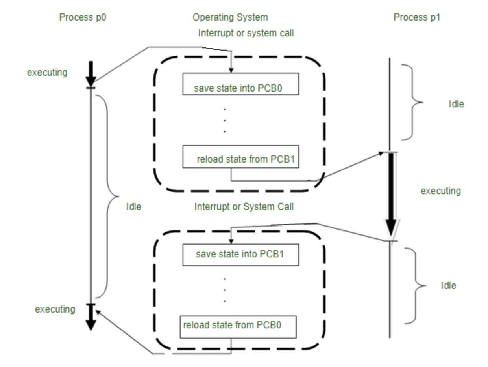

# Chapter 3: 운영체제
## Section 3.3: 프로세스와 스레드
### 3.3.1 프로세스와 컴파일 과정

- 프로세스(Process): 프로그램으로부터 인스턴스화 된 것을 말한다.
- 컴파일(Compilation): 프로그램이 컴파일러에 의해 컴퓨터가 이해할 수 있는 기계어로 번역되어 실행될 수 있는 파일이 되는 것을 말한다.
- C언어로 작성된 프로그램의 컴파일 과정은 다음과 같다.

(출처: [geeksforgeeks](https://www.geeksforgeeks.org/compiling-a-c-program-behind-the-scenes/))

#### 전처리기(Preprocess)

- 소스 코드의 주석 제거, 헤더 파일 병합 등의 컴파일 전 단계에 필요한 일 들을 수행한다.

#### 컴파일러(Compiler)

- 오류 처리, 코드 최적화 작업 등을 수행하며 어셈블리언어로 표현된 어셈블리 코드로 변환시킨다.

#### 어셈블러(Assembler)

- 어셈블리 코드를 목적 코드로 변환시킨다. 리눅스의 경우, 목적 코드의 확장자는 .o이다.

#### 링커(Linker)

- 프로그램 내에 있는 라이브러리 함수 또는 다른 파일들을 목적 코드와 결합하여 실행 파일을 만든다. 윈도우의 경우 .exe, 리눅스의 경우 .out의 확장자를 가진다.

##### 정적 라이브러리와 동적 라이브러리

- 정적 라이브러리: 프로그램 빌드 시 라이브러리가 제공하는 모든 코드를 실행 파일에 넣는 방식이다. 외부 의존도가 낮지만 코드 중복 등으로 메모리 효율성이 떨어질 수 있다.
- 동적 라이브러리: 프로그램 실행 시 필요할 때만 DLL이라는 함수 정보를 통해 참조하는 방식이다. 메모리 효율성이 높지만 외부 의존도 또한 높아진다.

### 3.3.2 프로세스의 상태

#### 생성(Create) 상태

- 프로세스가 생성된 상태를 말하며 fork() 또는 exec() 함수를 통해 생성하며, 이때 PCB가 할당된다.

##### fork()

- 부모 프로세스의 주소 공간을 그대로 복사해서 새로운 자식 프로세스를 생성하는 함수이다.
- 주소 공간만을 복사하기 때문에 부모 프로세스의 비동기 작업 등을 상속하지는 않는다.

##### exec()

- 독립적인 새로운 프로세스를 생성하는 함수이다.

#### 대기(Ready) 상태

- 메모리 공간이 충분하면 메모리를 할당받고 아니면 없는 상태로 대기하며 CPU 스케줄러로부터 CPU 소유권이 넘어오기를 기다리는 상태를 말한다.

#### 대기 중단(Ready Suspended) 상태

- 메모리 부족에 의해 대기가 잠시 중단된 상태를 말한다.

#### 실행(Running) 상태

- CPU 소유권과 메모리를 할당밥고 인스트럭션을 수행 중인 상태를 말한다. 이를 'CPU burst가 일어났다'고 하기도 한다.

#### 중단(Blocked) 상태

- 어떤 이벤트가 발생한 이후 끝나기를 기다리며 프로세스가 차단된 상태를 말한다.
- 많은 경우, IO 장치에 의한 인터럽트로 발생한다.

#### 일시 중단(Blocked Suspended) 상태

- 대시 중단과 유사하며, 중단 상태에서 프로세스를 실행하려고 했지만 메모리 부족으로 일시 중단된 상태를 말한다.

#### 종료(Terminated) 상태

- 메모리와 CPU 소유권을 모두 내려 놓는 상태를 말한다.
- 작업이 끝나서 종료 상태가 될 수도 있지만, 부모 프로세스의 abort로 자식 프로세스가 강제 종료 시킬 수도 있다.

### 3.3.3 프로세스의 메모리 구조

(출처: [geeksforgeeks](https://www.geeksforgeeks.org/memory-layout-of-c-program/))

- 위 메모리 구조는 C언어를 기반으로 작성되었다. 

- 스택과 힙이 있는 부분을 동적영역이라고 하며, 데이터(bss segment, data segement)와 코드(text)가 있는 부분을 정적 영역이라고 한다.

#### 스택(Stack)

- 지역변수, 매개변수, 함수가 저장되고 컴파일 시에 크기가 결정되며 동적이라는 특징이 있다.
- 스택은 재귀함수 호출 등으로 인해 그 크기가 동적으로 늘어날 수 있으며, 힙 메모리와의 충돌를 피하기 위해 두 메모리 사이에 공간을 비워 놓는다.

#### 힙(Heap)

- 동적으로 할당할 때 사용되며 런타임 시 크기가 결정된다. 예로서 C/C++의 벡터를 선언하면 이 공간에 할당되며, 동적이라는 특징이 있다.

#### 데이터 영역

- 전역변수, 정적변수가 저장되고 정적이라는 특징이 있다.

### 3.3.4 PCB
- **PCB(Process Control Block)**: OS에서 프로세스에 대한 메타데이터를 저장한 것을 말한다.
- 프로세스가 실행되면 OS는 프로세스 주소 값에 메모리를 할당하고 해당 프로세스의 메타데이터를 PCB에 저장하고 관리한다.
- 프로세스의 중요한 정보를 포함하고 있기 때문에 일반 사용자가 접근하지 못하도록 커널 스택의 가장 앞에 두고 관리한다.
- cf) *메타데이터(Meta data)*: 데이터와 관한 구조화된 데이터이자, 데이터를 설명하는 작은 데이터이다.
#### PCB의 구조
|내부 정보|설명|
|:---|:---|
|프로세스 스케줄링 상태|'생성','준비','실행','대기','완료' 등의 상태 정보|
|프로세스 ID(PID)|프로세스 식별 ID|
|프로세스 권한|컴퓨터 자원 또는 IO 디바이스에 대한 권한 정보|
|프로그램 카운터(Program Counter)|프로세스에서 실행해야 할 다음 명령어의 주소에 대한 포인터|
|CPU 레지스터|프로세스를 실행하기 위해 저장해야 할 레지스터에 대한 정보|
|CPU 스케줄링 정보|CPU 스케줄러에 의해 중단된 시간, 우선 순위, 최종 실행 시간 등|
|계정 정보|페이지 테이블, 스케쥴링 큐 포인터, 소유자, 부모 등|
|IO상태정보|프로세스에 할당된 IO 장치목록|
|포인터|부모 및 자식 프로세스에 대한 포인터, 프로세스가 위치한 메모리 주소에 대한 포인터, 할당된 자원에 대한 포인터 정보 등|

#### 컨텍스트 스위칭
- **컨텍스트 스위칭(Context Switching)**: 프로세스에 할당된 시간이 끝나거나 인터럽트에 의해 실행중인 프로세스를 잠시 멈추고 PCB를 교환하는 과정을 말한다.
- 싱글코어 CPU를 기준으로, 당장에 여러 프로그램을 동시에 실행하는 것처럼 보이지만 다른 프로세스와의 컨텍스트 스위칭이 아주 빠르게 일어나는 것이다.

(출처: [geeksforgeeks](https://www.geeksforgeeks.org/difference-between-swapping-and-context-switching/))

- 컨텍스트 스위칭에서의 비용은 유휴 시간(Idle time)과 캐시 미스로 볼 수 있다.
- 컨텍스트 스위칭이 일어날 때 프로세스가 가지고 있는 메모리 주소가 그대로 있으면 잘못된 주소 변환이 생기므로 캐시클리어가 일어나면서 캐시미스가 발생한다.
- 컨텍스트 스위칭은 스레드에서도 발생하며 스레드는 스택 영역을 제외한 모든 메모리를 공유하기 때문에 비용이 더 적고 필요한 시간도 짧다.

### 3.3.5 멀티프로세싱
- **멀티프로세싱(multi-processing)**: 여러 개의 프로세스를 통해 동시에 두 가지 이상의 일을 수행하는 것을 말한다.
- 특정 프로세스의 메모리, 프로세스 중 일부에 문제가 발생되더라도 다른 프로세스를 이용해서 처리할 수 있으며 신뢰성이 높다는 장점이 있다.

#### 웹 브라우저
- 웹 브라우저는 멀티프로세스 구조를 가지며, 구조를 이루는 프로세스들은 다음과 같다.
- *브라우저 프로세스*: 주소 표시줄, 북마크 막대, 뒤로 가기 버튼, 앞으로 가기 버튼 등을 담당하며 네트워크 요청이나 파일 접근 같은 권한을 담당한다.
- *렌더러 프로세스*: 웹 사이트에서 시각으로 볼 수 있는 모든 것을 제어한다.
- *플러그인 프로세스*: 웹 사이트에서 사용하는 플러그인을 제어한다.
- *GPU 프로세스*: GPU를 이용해서 화면을 그리는 부분을 제어한다.

#### IPC
- **IPC(Inter Process Communication)**: 프로세스끼리 데이터를 주고받고 공유 데이터를 관리하는 메커니즘을 말한다.
- 멀티프로세스 구조에서 프로세스는 IPC를 통해 서로 간의 데이터 교환을 수행한다.
- 종류로는 공유 메모리, 파일, 소켓, 익명 파이프, 명명 파이프, 메시지 큐가 있다.
- 메모리를 완전히 공유하기 때문에 스레드에 비해 속도는 떨어진다.

##### 공유 메모리
- **공유 메모리(Shared memory)**: 여러 프로세스에 동일한 메모리 블록에 대한 접근 권한이 부여되어 프로세스가 서로 통신할 수 있도록 공유 버퍼를 생성하는 것을 말한다.
- 기본적으로 각 프로세스의 메모리는 다른 프로세스가 접근할 수 없지만 공유 메모리를 통해 여러 프로세스가 하나의 메모리를 공유할 수 있다.
- 어떤 매개체를 통해 데이터를 주고 받지 않고 메모리 자체를 공유하는 방식이기 때문에 다른 IPC방식에 비해 가장 빠르지만 동작시의 동기화 처리가 필요하다.

##### 파일
- 디스크에 저장된 데이터 또는 파일 서버에서 제공한 데이터를 말한다.

##### 소켓
- 네트워크 인터페이스를 통해 전송하는 데이터를 말하며 TCP 소켓, UDP 소켓이 존재한다.

##### 익명 파이프
- **익명 파이프(Anonymous pipe)**: 프로세스 간에 FIFO 방식으로 읽히는 임시 공간인 파이프를 기반으로 데이터를 주고받으며, 단방향 방식의 읽기 전용, 쓰기 전용 파이프를 만들어서 작동하는 방식을 말한다.
- 부모, 자식 프로세스 사이에만 사용할 수 있고, 다른 네트워크상에서는 사용이 불가하다.

##### 명명된 파이프
- **명명된 파이프(Named pipe)**: 파이프 서버와 하나 이상의 파이프 클라이언트 간의 통신을 위한 명명된 단방향 또는 이중 파이프를 말한다.
- 클라이언트-서버 통신을 위한 별도의 파이프를 제공하며, 여러 파이프를 동시에 사용할 수 있다.
- 동일 컴퓨터내의 프로세스끼리는 물론 다른 네트워크상의 컴퓨터와도 통신할 수 있다.

##### 메시지 큐
- **메시지 큐(Message queue)**: 메시지를 큐에 담아서 관리하는 것을 말한다.
- 커널의 전역변수 형태 등 커널에서 전역적으로 관리된다.
- 다른 IPC 방식에 비해 사용법이 직관적이고 간단하며 손쉽게 메시지 큐에 접근할 수 있다.
- 공유 메모리를 사용했을 때의 동기화 구현을 대체하기 위해 메시지 큐를 사용하기도 한다.

### 3.3.6 스레드와 멀티스레딩
#### 스레드
- **스레드(Thread)**: 프로세스의 실행 가능한 가장 작은 단위이며, 하나의 프로세스는 여러 스레드를 가질 수 있다.
- 각각의 코드, 데이터, 스택, 힙 영역을 생성하는 프로세스와는 달리 스레드는 코드, 데이터, 힙은 스레드끼리 공유한다.

#### 멀티스레딩
- **멀티스레딩(Multi-threading)**: 프로세스 내 작업을 여러 개의 스레드, 멀티스레드로 처리하는 기법을 말한다.
- 스레드끼리 서로 자원을 공유하기 때문에 효율성이 높으며 동시성에서 장점을 가진다.
- e.g.) 스레드를 사용하는 웹 서버는 훨씬 더 적은 리소스를 소비하며, 한 스레드가 중단되어도 다른 스레드는 작업을 수행할 수 있다.
- 한 스레드에 문제가 생기면 다른 스레드에도 영향을 끼칠 수 있어서 스레드로 이루어진 프로세스에 영향을 미칠 수 있다.

### 3.3.7 공유 자원과 임계 영역
#### 공유 자원
- **공유 자원(Shared resource)**: 시스템 안에서 각 프로세스, 스레드가 함께 접근할 수 있는 자원이나 변수 등을 의미한다.
- **경쟁 상태(Race condition)**: 공유 자원을 두 개이상의 프로세스가 동시에 읽거나 쓰는 상황을 말한다. 동시에 접근을 시도할 때 접근의 타이밍이나 순서 등이 결과값에 영향을 줄 수 있는 상태이다.

#### 임계 영역
- **임계 영역(Critical section)**: 공유 자원에 접근할 때 순서 등의 이유로 결과가 달라지는 영역을 말한다.
- 이를 해결하기 위한 방법으로 크게 *뮤텍스*, *세마포어*, *모니터*가 있으며, 이들은 모두 *상호 배제*, *한정 대기*, *융통성*이라는 조건을 만족한다.
  - 상호 배제: 한 프로세스가 임계 영역에 들어갔을 때 다른 프로세스는 들어갈 수 없다.
  - 한정 대기: 특정 프로세스가 영원히 임계 영역에 들어가지 못하면 안된다.
  - 융통성: 한 프로세스가 다른 프로세스의 일을 방해해서는 안된다.
- 위 방법들 모두 기본적으로 자원에 대해 잠금(Lock)을 걸어두는 형태로 이루어진다.

##### 뮤텍스
- **뮤텍스(Mutex)**: 공유 자원을 사용하기 전에 설정을 하고, 사용이 끝나면 해제하는 잠금을 말한다. 잠금이 설정되면 다른 스레드는 잠긴 코드 영역에 접근할 수 없다.
- 뮤텍스는 하나의 상태만을 가진다. 즉, 잠김 또는 해제 상태만 존재한다.

##### 세마포어
- **세마포어(Semaphore)**: 일반화된 뮤텍스이자 간단한 정수 값 및 wait(= P함수)와 signal(= V 함수)로 공유 자원에 대한 접근을 차단한다.
- wait함수는 자신의 차례를 기다리는 함수이고 signal은 다음 프로세스로 순서를 넘겨주는 함수이다.
- 프로세스가 공유 자원에 접근하면 세마포어에서 wait 작업을 수행하고 프로세스가 공유 자원을 해제하면 signal 작업을 수행한다.

###### 바이너리 세마포어
- 0과 1의 두 가지 값만 가질 수 있는 세마포어이다.
- 구현이 유사하기 때문에 뮤텍스는 바이너리 세마포어라고 할 수 있다. 다만 뮤텍스는 리소스에 대한 접근을 동기화하는 데 사용하는 잠금 메커니즘이고, 세마포어는 신호를 기반으로 상호 배제가 일어나는 신호 메커니즘이다.

###### 카운팅 세마포어
- 여러 개의 값을 가질 수 있는 세마포어이다.
- 여러 자원에 대한 접근을 제어하는 데 사용된다.

###### 모니터
- 둘 이상의 스레드나 프로세스가 공유 자원에 안전하게 접근할 수 있도록 공유 자원을 숨기고 해당 접근에 대한 인터페이스만 제공한다.
- 모니터 큐를 통해 공유 자원에 대한 작업들을 순차적으로 처리한다.
- 세마포어보다 구현이 쉬우며 상호 배제는 자동으로 구현이 되지만, 세마포어는 상호배제를 명시적으로 구현해야한다.

### 3.3.8 교착 상태
- **교착 상태(Deadlock)**: 두 개 이상의 프로세스들이 서로가 가진 자원을 기다리며 중단된 상태를 말한다.

#### 교착 상태의 원인
1. 상호 배제: 한 프로세스가 자원을 독점하고 있어서 다른 프로세스가 접근을 하지 못하는 상황
2. 점유 대기: 특정 프로세스가 점유한 자원을 다른 프로세스가 요청하고 있는 상황
3. 비선점: 다른 프로세스의 자원을 강제로 가져오지 못하는 것
4. 환형 대기: 프로세스 A는 프로세스 B의 자원을 요구하고, 프로세스 B는 프로세스 A의 자원을 요구하는 등의 행위를 하면서 서로가 서로의 자원을 요구하고 있는 상황

#### 교착 상태의 해결 방법
1. 자원을 할당할 때 교착 상태의 원인이 성립되지 않도록 설계한다.
2. 교착 상태 가능성이 없을 때만 자원을 할당하며, 프로세스당 요청할 자원의 최대치를 통해 자원 할당 가능 여부를 파악하는 ***은행원 알고리즘***을 사용한다.
   - 은행원 알고리즘: 총 자원의 양과 현재 할당한 자원의 양을 기준으로 안정 또는 불안정 상태로 나누고 안정 상태로 가도록 자원을 할당하는 알고리즘
3. 교착 상태가 발생하면 사이클이 있는지를 확인하고 이에 관한 프로세스를 하나씩 삭제한다.
4. 교착 상태는 매우 드물게 일어나고 이를 처리하는 비용이 더 크기 때문에 교착 상태가 발생하면 사용자가 작업을 종료한다.