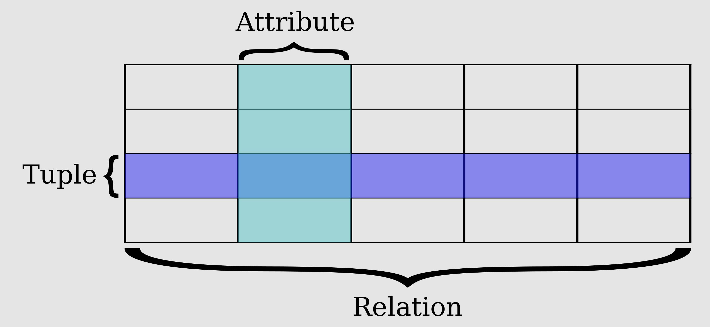
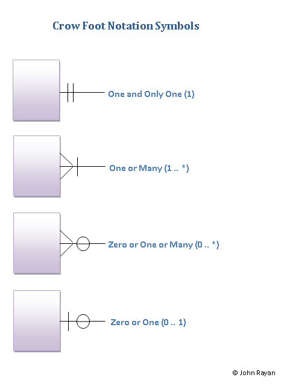

# Chapter 4: 데이터베이스
## Section 4.1: 데이터베이스의 기본
- **데이터베이스(DB, Database)**: 일정한 규칙, 혹은 규약을 통해 구조화되어 저장되는 데이터의 모음이다.
- **데이터베이스 관리 시스템(DBMS, Database Management System)**: 데이터베이스를 제어, 관리하는 통합 시스템을 말한다.
- DB 내의 데이터들은 특정 DBMS마다 정의된 쿼리 언어(Query Language)를 통해 삽입, 삭제, 수정, 조회 등을 할 수 있다.
- DB는 실시간 접근과 동시 공유가 가능하다.

### 4.1.1 엔티티
- **엔티티(Entity)**: 사람, 장소, 물건, 사건, 개념 등 여러 개의 속성을 지닌 명사를 의미한다.

#### 약한 엔티티와 강한 엔티티
- **약한 엔티티(Weak Entity)**: Key attribute(Primary key)가 없는 개체를 말하며 weak entity set은 primary key를 형성할 충분한 속성을 가지고 있지 않다.
- **강한 엔티티(Strong Entity)**: weak entity와 달리 primary key를 가지고 있는 개체를 말한다. 또한 식별 객체 집합이라고도 한다.
- 약한 개체 집합은 다른 개체 집합에 의존하게 되고 이 때 연관되는 개체 집합을 ***식별 개체 집합(Identifying entity set)**이라고 하며, 이러한 관계를 식별자 관계(Identifying relationship)이라고 한다. 이는 약한 개체가 하나인 one to many 관계이며 전체 참여 관계를 맺어야한다.

### 4.1.2 릴레이션
- **릴레이션(Relation)**: 데이터베이스에서 정보를 구분하여 저장하는 기본 단위이며 엔티티에 관한 데이터를 데이터베이스는 릴레이션 하나에 담아서 관리한다.
- 관계형 데이터베이스에서 릴레이션은 테이블이라고 하며, NoSQL 데이터베이스에서는 컬렉션이라고 한다.

#### 테이블과 컬렉션
- RDB의 대표적인 예인 MySQL은 레코드-테이블-데이터베이스의 구조를 이룬다.
- NoSQL DB의 대표적인 예인 MongoDB는 도큐먼트-컬렉션-데이터베이스로 이루어져 있다.

### 4.1.3 속성
- **속성(Attribute)**: 릴레이션에서 관리하는 구체적이며 고유한 이름을 갖는 정보이다.
- 서비스의 요구 사항을 기반으로 관리해야 할 필요가 있는 속성들만 엔티티의 속성이 된다.

### 4.1.4 도메인
- **도메인(Domain)**: 릴레이션에 포함된 각각의 속성들이 가질 수 있는 값의 집합을 말한다.

### 4.1.5 필드와 레코드
- 테이블에서 행을 레코드(Record, 또는 튜플(Tuple)), 열을 필드(Field)라고 하며 각 속성에 맞는 타입을 정의해야한다.

#### 필드 타입
- 필드는 타입을 가지며 아래는 MySQL을 예시로 한다.

##### 숫자 타입
- 숫자 타입으로는 TINYINT, SMALLINT, MEDIUMINT, INT, BIGINT 등이 있다.

##### 날짜 타입
- 날짜 타입으로는 DATE, DATETIME, TIMESTAMP 등이 있다.
###### DATE
- 시간 정보 없이 날짜만 존재하는 타입이며 3byte를 사용한다.
###### DATETIME
- 날짜와 시간 정보를 모두 포함하는 타입이며 8byte를 사용한다.
###### TIMESTAMP
- 날짜 및 시간 정보를 모두 포함하는 타입이며 4byte를 사용한다. 1000년이 시작이 아닌 1970년에서 시작한다.

#### 문자 타입
- 문자 타입으로는 CHAR, VARCHAR, TEXT, BLOB, ENUM, SET이 있다.
##### CHAR과 VARCHAR
- CHAR과 VARCHAR 모두 문자열의 길이를 입력하여 정의한다.
- CHAR는 테이블 생성 시에 선언한 길이로 고정되어 그 값은 0과 255 사이의 값을 가진다. 입력한 값이 무엇이 되든 그 길이로 고정되어 저장된다.
- VARCHAR는 가변길이의 문자열이며 0에서 65,535 사이의 길이 값을 가질 수 있고, 입력된 데이터에 따라 그 길이를 가변시켜서 저장한다. 길이 저장용의 1byte도 같이 사용되므로 최종적인 길이는 '문자열(byte) + 길이 정보(byte)'가 된다.

##### TEXT와 BLOB
- TEXT와 BLOB 모두 큰 데이터를 저장할 때 쓰는 타입이다.
- TEXT는 큰 문자열 저장에 쓰이며 게시판의 본문 등을 저장할 때 사용된다.
- BLOB은 이미지, 동영상 등 큰 데이터 저장에 사용이지만, 보통은 서버에 파일을 저장하고 해당 파일의 경로를 VARCHAR로 저장하는 형식을 취한다.

##### ENUM과 SET
- ENUM과 SET 모두 문자열을 열거한 타입이다.
- ENUM은 나열된 요소들 중에서 하나의 값만 가질 수 있고 ENUM 리스트에 없는 값을 삽입하면 빈 문자열이 대신 삽입된다. 각 데이터들은 인덱스에 매핑되어 저장되므로 메모리를 적게 사용하고, 최대 65,535개의 요소를 선언할 수 있다.
- SET은 ENUM과 비슷하지만 여러 개의 요소를 가질 수 있다. 비트 연산을 할 수 있으며 최대 64개의 요소를 가질 수 있다.
- ENUM이나 SET을 사용하면 공간을 절약할 수 있지만 응용 프로그램의 수정에 따라 내부의 요소들도 수정해야할 수 있다.

### 4.1.6 관계
- DB내의 여러 테이블은 서로의 관계가 정의되며 이는 관계화살표로 나타낸다.
- 아래는 관계 화살표 표현법 중에 하나인 *crow's foot*이다.

#### 관계 예시
|관계|예시|
|:---|:---|
|1:1|유저 - 이메일|
|1:N|유저 - 장바구니상품|
|N:M|학생 - 강의|

### 4.1.7 키
- 테이블 간의 관계를 조금 더 명확하게 하고 테이블 자체의 인덱스를 위해 키를 사용한다.
- 슈퍼키는 유일성이 있고, 이에 포함된 후보키는 최소성을 갖추고 있다.
  - 유일성: 중복되는 값이 없는 속성
  - 최소성: 필드를 조합하지 않고 최소 필드만 써서 키를 형성할 수 있는 속성
- 후보키 중에서 기본키로 선택되지 못한 키는 대체키가 된다.

#### 기본키
- **기본키(Primary Key)**: 유일성과 최소성을 만족하는 키이다.
- 테이블의 데이터에 대해 고유하게 존재하는 속성이므로 중복되어서는 안된다.
- 복합키를 사용하게 되면 최소성을 만족하지 않으므로 사용하지 않는다.

##### 자연키
- 여러 속성 중에서 중복된 값을 제외하며 중복되지 않는 것을 선정했을 때 나오는 키를 말한다.
- 그 값이 변할 수 있다는 특징을 가진다.

##### 인조키
- 인위적으로 생성한 키이며 그 값이 변하지 않는다.
- 불변을 속성에 의해 보통 기본키는 인조키를 사용한다.

#### 외래키
- **외래키(Foreign Key)**: 다른 테이블의 기본키를 그대로 참조하는 값을 말한다.
- 객체와의 관계를 식별하는 데 사용하며 중복이 가능하다.

#### 후보키
- **후보키(Candidate Key)**: 기본키가 될 수 있는 후보들을 말하며 유일성과 최소성을 동시에 만족한다.

#### 대체키
- **대체키(Alternate Key)**: 후보키가 두 개 이상일 경우 어느 하나를 기본키로 지정하고 남은 나머지 후보키들을 말한다.

#### 슈퍼키
- **슈퍼키(Super Key)**: 각 레코드를 유일하게 식별할 수 있는 유일성을 갖춘 키를 말한다.